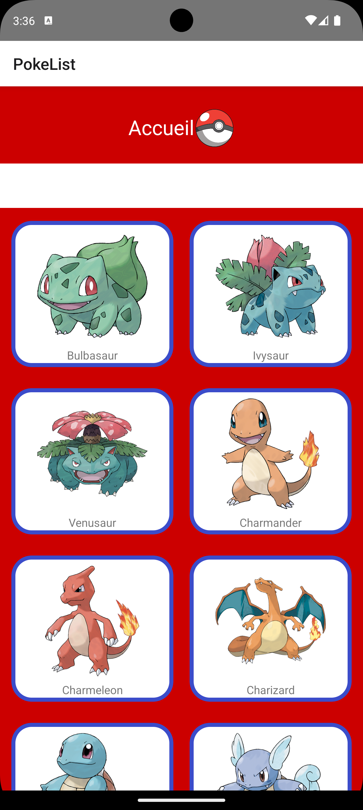

# ECF2 Fares DRIES (React-Native/PokéApi)

Ce projet est un ECF pour ma formation CDA chez M2IFormation, cet ECF utilise React-Native ainsi que l'API REST PokéApi ainsi qu'un émulateur Android Studio

## Récupération du projet 

Pour récupérer le projet vous n'avez qu'à saisir la commande ci dessous dans un terminal.
```bash
git clone https://github.com/FaresDr/ECF2FARES_DRIES.git
```
## Installation des dépendences 

Après avoir récupérer l'ensemble du projet il faut évidemment installer quelque packages via le node Package Manager et ces packages sont les suivants 

```bash
npm install @react-navigation/bottom-tabs
npm install @react-navigation/native
npm install @react-navigation/native-stack
npm install @reduxjs/toolkit
npm install axios
```

## Démarrer l'application

Pour démarrer l'application il faudra vous munir d'un émulateur type Android Studio puis de créer un appareil Android et bien sur de la mettre en route.

Une fois cela fait rendez vous dans le dossier "ECF2" puis éxecuter la commande
```bash
npx react-native run-android
```

Après avoir fais cela vous devriez vous retrouver sur la page d'accueil de l'application




Cette page est done notre page d'accueil ou on à la liste des 151 premiers Pokemon, bien sur on peux en avoir plus mais cela est fait pour éviter de surcharger l'émulateur


## Les fonctionnalités 

Après avoir lancé l'application vous vous trouvez donc devant la page d'accueil, cependant il est possible de cliquer sur un pokémon de votre choix afin d'obtenir des renseignements plus poussé qu'uniquement le nom 


Il est aussi possible de voir les évolutions possible de la famille du pokémon choisi en cliquant sur le bouton "Voir les évolutions" ce qui vous enverra sur une page ou vous pourrez voir les pokémons liès à celui de votre choix


Pour l'instant si vous cliquez sur l'un des trois pokémons vous serrez renvoyés sur la page d'accueil car une page de détails bien plus poussés est en cours de création.

## Le Pokédex

Bien sur n'importe quel dresseur voudrait pouvoir capturer des pokémons afin des les enregistrer dans son propre Pokédex

Et bien aujourdh'ui cela est possible avec ce programme.

Pour accédez à votre propre pokédex il vous suffira de vous rendre sur la page d'acceuil et puis de cliquer sur la petite pokéball à coté de "Accueil"


Pour l'instant mon Pokédex est vide mais allons ensemble le replir avec un Dracaufeu, un Florizarre ainsi qu'un Tortank et d'autre afin de remporter la Ligue Pokémon

Après vous avoir été rendu sur les différentes page des pokémons de votre choix et avoir cliquer sur le bouton "Ajouter au Pokédex" Vous pouvez maintenant admirer les Pokémons que vous avez capturer 


Et bien sur il est aussi possible de vider votre pokédex en appuyant simplement sur "Vider le pokédex"


## Liens Utile

Lien vers l'API_REST Pokemon utilisé  
[PokéApi](https://pokeapi.co/)  
Lien vers l'émulateur Android Studio  
[AndroidStudio](https://developer.android.com/studio)  
Lien vers React Native qui est la principale techonlogie utilisé  
[React Native](https://reactnative.dev/)  
Lien vers le repo du projet PokéApi React Native  
[GitHub du Proket](https://github.com/FaresDr/ECF2FARES_DRIES)